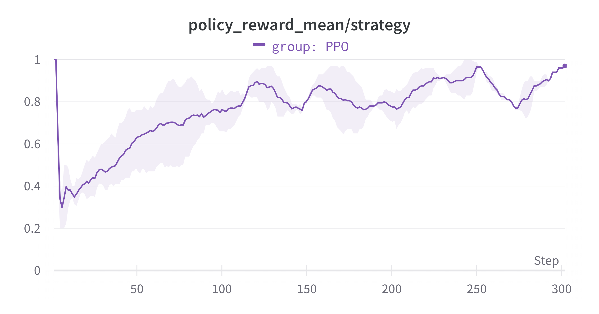

# Designing an interface for hierarchical environments

This is a mini-project related to the blog post.
It contains both our HRL interface and an example on how to use it.
The easiest way to use it in your project is to link directly to this repository
or using prebuild package (see `Building a package` section below).

## Prerequisites

Install [poetry](https://python-poetry.org/).

## Installation

Run:

```shell
poetry install
```

or

```shell
poetry install -E torch
```

if you'd like to run the example.

## Building a package

Use:

```shell
poetry build
```

The built distributions will be stored in the `dist` directory.

## Running the example

To run tests use:

```shell
cd examples/maze
PYTHONPATH=. pytest
```

To train an agent use:

```shell
cd examples/maze
PYTHONPATH=. python train.py
```

By default logging to Weights&Biases is disabled. To enable it,
set `log_to_wandb` to `True` and update your credentials.

Below you can see training performance of the strategy agent.


